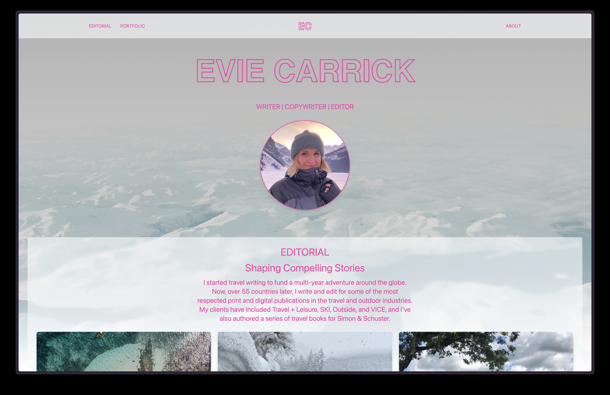

# Evie Carrick's Portfolio Website

A modern, responsive portfolio website built with ❤️ for Evie Carrick!



## 🚀 Features

- Modern, responsive design using Tailwind CSS
- Component-based architecture for maintainable code
- Optimized build process for production deployment
- AWS infrastructure for reliable hosting
- Continuous Integration/Continuous Deployment (CI/CD) pipeline

## 🛠️ Technology Stack

- **Frontend Framework**: Vanilla JavaScript with component-based architecture
- **Styling**: Tailwind CSS for utility-first styling
- **Build Tools**:
  - PostCSS for CSS processing
  - Node.js build scripts
  - Live reload for development
- **Infrastructure**:
  - AWS CloudFront for CDN
  - AWS S3 for static hosting
  - AWS Route 53 for DNS management
  - AWS Certificate Manager for SSL/TLS
- **Development Tools**:
  - Nodemon for development watching
  - Live Server for local development
  - Concurrent script execution

## 📋 Prerequisites

- Node.js (v18 or higher)
- npm (v9 or higher)
- AWS CLI (for deployment)

## 🏗️ Project Structure

```
eviecarrick.com/
├── website/                # Main website code
│   ├── src/               # Source files
│   │   ├── components/    # Reusable components
│   │   ├── js/           # JavaScript modules
│   │   └── input.css     # Tailwind CSS entry
│   ├── public/           # Static assets
│   └── dist/             # Built files
├── infrastructure/        # AWS infrastructure code
└── docs/                 # Documentation
```

## 🚀 Deployment

The website is automatically deployed through GitHub Actions when changes are pushed to the main branch. The deployment process:

1. Builds the website
2. Optimizes assets
3. Uploads to AWS S3
4. Invalidates CloudFront cache

## 🧪 Development

- Run `npm run dev` for development with live reload
- Run `npm run build` for production build
- Run `npm run test` for testing

## 📝 License

This project is licensed under the MIT License - see the [LICENSE](LICENSE) file for details.

## 📬 Contact

Devin Carrick - devin.carrick@gmail.com

Project Link: [https://eviecarrick.com](https://eviecarrick.com)
